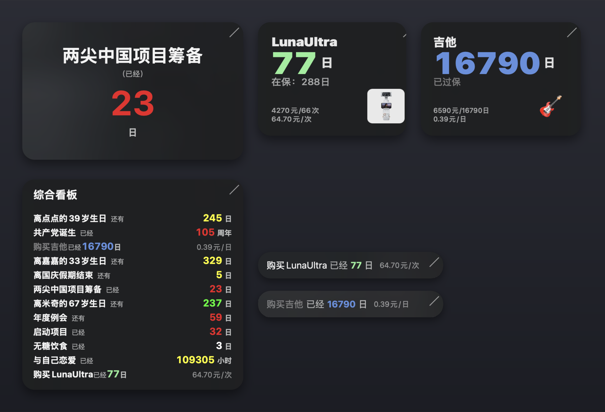

# 纪念日、资产anytypeMacOS桌面组件（可基于any-sync网络同步数据）

<p align="center">
  
</p>

一组真正「跑在 any-sync 上」的桌面悬浮小组件：

- **数据存哪**：每个纪念日/资产是一个 **Anytype 对象**（纪念日类型 `ji_nian_ri`、资产类型 `zi_chan`，聚合面板类型 `ju_he_mian_ban`），存放在官方客户端正在同步的空间里。官方客户端通过 your 部署的 any-sync 网络把对象同步到所有设备。
- **怎么读写**：命令行和小组件都走官方桌面端本地 API（`127.0.0.1:31009`），同步那块脏活由官方客户端搞定。
- **跨设备同步**：任何设备改了对象（应用里改、或命令行改），小组件 60 秒内自动跟上。

***

## 命令行（终端敲 `anniversary`）

```bash
anniversary objects [类型key]          # 列对象（缺省纪念日；zi_chan=资产，ju_he_mian_ban=聚合面板）
anniversary read-object <id>           # 读单个对象：{name, date_iso, color, icon, 偏好…}
anniversary set-date <id> "2026-12-25 08:00"   # 改「纪念日日期」字段（本地时间）
anniversary icon-image <id> [输出路径] # 取对象图标（file→下载图片；emoji→返回emoji）
anniversary set-size <id> <宽> <高>    # 把当前宽度/当前高度写回对象
anniversary set-mini <id> <是|否>      # 写回对象「迷你模式」字段
anniversary inc-uses <id> [增量]       # 资产使用次数 +N（减一传 -1，默认 1）
anniversary types                      # 列空间内所有对象类型
anniversary widget <对象名> [模式]     # 开一个新小组件窗口绑定该对象
anniversary panel [面板名]             # 开一个聚合面板窗口(会在anytype回写新建一个类型为“聚合面板”的对象)
anniversary panel-data <面板id>        # 读面板配置 + 成员行数据
anniversary panel-set <面板id> '<属性json>'       # 改面板属性（排序/筛选/限制数量等）
anniversary panel-set-types <面板id> <类型key逗号列表>  # 改面板成员类型
anniversary new-panel [名称]           # 新建聚合面板对象
```

模式：`正计日`（已经多少天）/ `倒计日`（还有多少天）/ `正计时`（多少小时）/ `倒计时`（还有多少小时）/ `周年计数`（已经多少周年）/ `最近重复日`（下一个同月日还有多少天）。

仅依赖 Python 3 标准库，无需 pip 安装任何包。安装到 PATH：

```bash
chmod +x anniversary.py
ln -s "$PWD/anniversary.py" /usr/local/bin/anniversary   # 或 ln 到 ~/bin 等 PATH 目录
```

## macOS 桌面小组件（多实例）

**每个窗口 = 一个独立实例 = 绑定一个对象（纪念日 / 资产）或一个聚合面板。** 可多开、各自独立。

- **启动**：双击 `CountdownWidget.app` 即开新窗口（默认第一个纪念日）；终端可用 `anniversary widget 恋爱纪念日 正计日` 指定对象启动
- **右键菜单**：
  - `对象类型` → 列出空间内所有类型；当前支持「纪念日」「聚合面板」「资产」，其它灰显标注（暂不支持）
  - `选择对象` → 二级菜单列出该类型对象，点击即切换该窗口
  - `模式` / `计费方式` → 纪念日：正计日/倒计日/正计时/倒计时/周年计数/最近重复日；资产：使用时长计费/使用次数计费（默认跟随对象）
  - `迷你模式` → 单行小长条；高度锁定贴合，横向拉伸显示完整
  - `排版` → 迷你行：居中/左对齐/两端对齐；面板行：自然紧凑/两端对齐（标题截断加省略号）
  - `修改时间…` → 时间选择器改「纪念日日期」字段，立刻刷新
  - `复制窗口` → 以当前对象+配置新开一个窗口（位置偏移 +24/+24 避免重叠）
  - `新建聚合面板` → 再开一个聚合面板
  - `马上刷新最新数据` → 不等 60s，立即重新拉取对象
  - `锁定大小` → 禁止拖拽缩放
  - `置顶` → 切换是否永远悬浮在其他窗口之上
  - `关闭此窗口` → 关闭该窗口
- **纪念日 UI**：标题（粗体）+ 小字（已经/还有）→ 大号数值 → 小号单位；数值按对象「颜色」字段上色；单位随模式在「日/小时」间切换
- **图标背景**：纪念日对象设置了图标时，去掉毛玻璃、改用图标图片做背景（70% 透明度，随 60s 拉取刷新）；无图标则沿用毛玻璃。支持 `file` 与 `emoji` 两种图标（资产/聚合面板/迷你模式恒用毛玻璃）
- **滚轮缩放**：窗口聚焦时滚轮/双指上下调整整体字号（0.7\~1.8 倍，步进 0.05），缩放值持久化在实例配置里
- **缩放抓手**：统一在窗口右上角（三条斜线），拖动调整大小
- **刷新**：每 60s 拉一次对象（标题/日期/颜色/图标变动自动跟上），每 30s 本地重算数值
- **对象偏好（Anytype 里配置）**：`默认模式`（mo\_shi）、`迷你模式`（mi\_ni\_mo\_shi）、资产`默认计费方式`在首次绑定对象时作为默认值应用；纪念日拖动/缩放结束自动把尺寸写回对象 `当前宽度`/`当前高度`
- **恢复**：每个实例配置存 `~/.whynownote/widgets/<id>.json`（对象/模式/位置/锁定/置顶/迷你/缩放/排版），实例 ID 用毫秒时间戳，操作后自动保存

### 资产卡片（zi\_chan 类型）

- **字段**：`购买日期`(gou\_mai\_iso)、`保修到期日`(bao\_xiu\_iso)、`价格`(price)、`使用次数`(uses)、`计数周期`(period：日/月/年)、`默认计费方式`(asset\_mode)
- **标准模式**（js.design 规格）：圆角 20 卡片，四边内边距 20；第一行左列＝标题 20pt Heavy ＋ 50pt 大数字（anytype 颜色）+20pt 单位 ＋ 15pt「在保：N日」；第二行＝左下价格/均价两行 11pt（白 60%）＋ 右下 56×56 圆角 8 图标。高固定（184×缩放）、宽贴合内容、可拖宽只扩不收
- **图标即热区**（仅「使用次数计费」可交互）：单击图标次数 +1，长按 0.6s 弹确认窗 −1；悬停手型光标、0.9→1.0 增亮反馈；按下图标时不会误拖窗口
- **迷你模式**：单行 `购买{标题}已经{N}{周期} {均价}`（均价半透明小字；次数计费单位「元/次」，时长计费单位「元/日·月·年」）；不显示图标
- **计数规则**：按完整周期（日/月/年）计数；不足 1 周期显示 1、到期显示 0；价格或除数为 0 时均价显示 `–`；价格整数、均价两位小数

### 聚合面板（ju\_he\_mian\_ban 类型）

- 一个窗口按行列出成员对象（左标题+小字、右数值+单位，数值按各对象「颜色」字段上色）；高度随行数自动贴合，宽可拉伸
- **成员类型**：纪念日 / 聚合面板 / 资产（资产行按迷你模式逻辑显示）
- **面板配置**（Anytype 面板对象字段）：成员类型、日期计数默认模式、分类/标签筛选、手选显示对象（非空则只显示手选）、排序（名称/计数值 升降序）、`限制显示数量`(xian\_zhi\_xian\_shi\_shu\_liang)
- **标题变量**：`{日期::format}` 按 format 渲染当前日期时间（如 `{日期::MM-dd}`），`{星期}` 渲染为「星期一」\~「星期日」；变量只对面板顶部大标题生效

> 说明：倒计模式是「绝对倒数」——只有目标时间在未来才有值；目标是过去时间时显示 0。想看"已经过了多久"请用正计模式。

## 下载安装（推荐，无需编译）

**环境要求**：Apple Silicon（M 系列）Mac、macOS 12 或更高；安装并登录 [Anytype 桌面端](https://anytype.io/)，且已在授权向导中启用本地 API。

### 1. 下载应用

到 [Releases](https://github.com/raysico/anytypeWidget/releases) 下载最新的 `CountdownWidget-vX.Y.Z-macOS.zip`，解压后把 `CountdownWidget.app` 拖进「应用程序」文件夹。

### 2. 首次打开（处理安全提示）

应用使用本地自签名（ad-hoc），未经过 Apple 公证，首次双击会提示「无法验证开发者」。任选其一放行：

- **图形方式**：在「应用程序」里**右键点 `CountdownWidget.app` → 打开 → 再点「打开」**（只需一次，之后可正常双击）。
- **命令行方式**：

```bash
xattr -dr com.apple.quarantine /Applications/CountdownWidget.app
```

> 应用是无 Dock 图标的后台悬浮组件（`LSUIElement`），启动后只看到桌面上的悬浮卡，Dock 中不会出现图标。

### 3. 一次性授权（连接 Anytype）

首次使用需要配置本地 API Key。发布包已内置 `anniversary.py`，直接执行：

```bash
/usr/bin/python3 /Applications/CountdownWidget.app/Contents/Resources/anniversary.py init --api-key <你的API Key>
```

按提示在 Anytype 桌面端完成一次性授权（输入 4 位验证码）。配置保存在 `~/.whynownote/wnn.json`（权限 600）。

想在终端直接敲 `anniversary` 命令，可加软链（可选）：

```bash
ln -s /Applications/CountdownWidget.app/Contents/Resources/anniversary.py /usr/local/bin/anniversary
```

### 4. 启动与多开

- **双击 `CountdownWidget.app`** 即出现一个悬浮小组件窗口（默认绑定空间里第一个纪念日对象，可右键改绑）；
- **再次双击会再开一个新窗口**，每个窗口独立绑定对象、独立配置，想多开几个都行；
- 窗口配置自动保存在 `~/.whynownote/widgets/<实例id>.json`。

> **找不到窗口？** 若之前接过外接显示器，窗口可能停在已不存在的屏幕坐标上——v1.0.0 起启动时会检测，落在屏幕外的窗口自动回到主屏右上角。

## 从源码构建

环境：macOS（自带 Swift 与 `/usr/bin/python3`，无需 pip 安装任何包），且 Anytype 桌面端正在运行。

```bash
# 0. 一次性授权（源码目录里）
/usr/bin/python3 anniversary.py init --api-key <你的API Key>

# 1. 编译小组件（仓库根目录产出可执行文件）
/usr/bin/swiftc CountdownWidget.swift -o CountdownWidget-bin

# 2a. 直接运行（可重复执行开多个实例）
./CountdownWidget-bin --instance <实例id，任意字符串>

# 2b. 打包为 .app：组装 bundle（Info.plist 模板 + 内置 CLI 脚本）后本地签名
mkdir -p CountdownWidget.app/Contents/MacOS CountdownWidget.app/Contents/Resources
cp CountdownWidget-bin CountdownWidget.app/Contents/MacOS/CountdownWidget
cp anniversary.py CountdownWidget.app/Contents/Resources/anniversary.py
cp Info.plist CountdownWidget.app/Contents/Info.plist
codesign --force --sign - CountdownWidget.app
open -n CountdownWidget.app

# 3. 发布用压缩包（ditto 保留代码签名与权限，不要用 Finder 直接压缩）
ditto -c -k --keepParent CountdownWidget.app CountdownWidget-v1.0.0-macOS.zip
```

小组件按以下顺序查找 `anniversary.py`（不写死个人路径）：

1. 环境变量 `WNN_ANNIVERSARY_PY` 指向的脚本
2. `.app` 包 Resources 内的 `anniversary.py`（发布包默认走这里）
3. 可执行文件同目录（仓库根直接编译运行）
4. `.app` 包上一级目录（`.app` 放在仓库根时）
5. `.app` 包根目录
6. PATH 中的 `anniversary` 命令（如上面的软链）

## 文件

| 文件                             | 作用                                       |
| ------------------------------ | ---------------------------------------- |
| `anniversary.py`               | 命令行（数据入口：objects / read-object / set-date / panel-\* / widget） |
| `CountdownWidget.swift`        | 小组件源码（单文件，直接 swiftc 编译）                  |
| `CountdownWidget.app`          | 本地构建的应用包（BundleID `local.whynownote.countdownwidget`，不入库） |
| `Info.plist`                   | 应用包配置模板（版本号 / `LSUIElement` 后台组件 / 最低系统版本），打包时复制进 .app |
| `LICENSE`                      | MIT 许可证                                  |
| `~/.whynownote/wnn.json`       | API 配置（权限 600，别外传）                       |
| `~/.whynownote/widgets/*.json` | 各实例配置                                    |

## 前提

- **Anytype 桌面端必须正在运行**。
- 首次授权：桌面端输入 4 位验证码（一次性）。

## 架构

```
你的 any-sync 网络 (6 节点)
        ▲ 同步
   官方 Anytype 桌面端 (已授权)
        ▲ 本地 API (127.0.0.1:31009)
   ┌──────┬──────────┐
 anniversary 命令  小组件实例1  小组件实例2 …
```

